# Social Listening V1 ERD Impact Design

## Document Status

This document converts `docs/social_listening_v1_backlog.md` into a database-oriented ERD impact design for the Social Listening V1 candidate scope.

This document is **not a SQL migration** and is **not an implementation instruction** by itself. It is the approved next design layer before SQL DDL, OpenAPI, QA, and Sprint implementation prompts are generated.

Implementation authority requires the full chain below:

1. Backlog candidate.
2. ERD impact design.
3. SQL DDL / migration design.
4. OpenAPI contract patch.
5. QA test suite.
6. Sprint implementation prompt.

---

## Executive Decision

Social Listening V1 should be modeled as a bounded domain inside Marketing OS, not as a separate product and not as an uncontrolled social scraping subsystem.

The ERD must enforce:

1. `workspace_id` on every Social Listening business table.
2. Explicit source, keyword, and mention ownership.
3. Idempotent ingestion and scoring.
4. Versioned sentiment results.
5. Snapshot-based dashboards.
6. Alert events traceable to evidence.
7. No mutation of historical facts when configuration changes.
8. No stock/trading/investment prediction concepts.
9. No raw credential exposure.
10. No direct dependency on any reviewed GitHub project as source of truth.

---

## Scope Guardrails

### Included in this ERD

- Monitored sources.
- Source rate-limit and failure state.
- Monitored keywords.
- Mention matching table.
- Normalized social mentions.
- Analysis jobs.
- Sentiment provider configuration.
- Sentiment results.
- Trend snapshots.
- Alert rules.
- Alert events.
- Export jobs.
- Audit event expectations.

### Excluded from this ERD

- Auto-publishing.
- Paid campaign execution.
- AI agent execution.
- Stock prediction.
- BUY/SELL/HOLD trading signals.
- Advanced attribution.
- ROI prediction.
- Uplift modeling.
- Full streaming warehouse design.
- Scraping-specific schema that violates platform terms.
- Notebook-based ML execution.

---

## Existing Core Entities to Reuse

The following entities are assumed to already exist or to be owned by the core platform. This ERD does not redefine them.

| Existing Entity | Required Relationship |
|---|---|
| `workspaces` | Tenant boundary for every Social Listening table |
| `users` | Actor for create/update/acknowledge/export actions |
| `audit_logs` | Must record configuration and sensitive operational changes |
| `connector_credentials` | Credential reference only; secrets must remain encrypted and hidden |
| `roles` / `permissions` | Must enforce Social Listening RBAC |
| `background_jobs` or equivalent | May be reused if the project already has a generic job system |

If any of these core entities do not exist in the repository, they must be defined in the core platform ERD before Social Listening is implemented.

---

## Source-of-Truth Rules

| Area | Source of Truth | Rule |
|---|---|---|
| Tenant ownership | `workspace_id` on each Social Listening table | Never infer workspace only through joins |
| Monitored configuration | `social_monitored_keywords`, `social_monitored_sources` | Historical mentions must not be deleted when config changes |
| External mention identity | `social_mentions.external_id` + source/workspace | Duplicates must be prevented |
| Mention-to-keyword relationship | `social_mention_keyword_matches` | A mention may match multiple keywords |
| Sentiment score | `social_sentiment_results` | Versioned, append-safe, model traceable |
| Dashboard data | `social_trend_snapshots` | UI should prefer snapshots over raw aggregation |
| Alerts | `social_alert_events` | Events must reference rule and evidence |
| Connector state | `social_source_rate_limit_states`, `social_source_failure_events` | Do not hide provider failures |
| Exports | `social_export_jobs` | Export must be permissioned and audit logged |

---

## High-Level ERD

```mermaid
erDiagram
    WORKSPACES ||--o{ SOCIAL_MONITORED_SOURCES : owns
    WORKSPACES ||--o{ SOCIAL_MONITORED_KEYWORDS : owns
    WORKSPACES ||--o{ SOCIAL_ANALYSIS_JOBS : owns
    WORKSPACES ||--o{ SOCIAL_MENTIONS : owns
    WORKSPACES ||--o{ SOCIAL_SENTIMENT_PROVIDER_CONFIGS : owns
    WORKSPACES ||--o{ SOCIAL_SENTIMENT_RESULTS : owns
    WORKSPACES ||--o{ SOCIAL_TREND_SNAPSHOTS : owns
    WORKSPACES ||--o{ SOCIAL_ALERT_RULES : owns
    WORKSPACES ||--o{ SOCIAL_ALERT_EVENTS : owns
    WORKSPACES ||--o{ SOCIAL_EXPORT_JOBS : owns

    CONNECTOR_CREDENTIALS ||--o{ SOCIAL_MONITORED_SOURCES : referenced_by

    SOCIAL_MONITORED_SOURCES ||--o{ SOCIAL_SOURCE_RATE_LIMIT_STATES : has
    SOCIAL_MONITORED_SOURCES ||--o{ SOCIAL_SOURCE_FAILURE_EVENTS : has
    SOCIAL_MONITORED_SOURCES ||--o{ SOCIAL_MENTIONS : ingests

    SOCIAL_MONITORED_KEYWORDS ||--o{ SOCIAL_MENTION_KEYWORD_MATCHES : matched_by
    SOCIAL_MENTIONS ||--o{ SOCIAL_MENTION_KEYWORD_MATCHES : matches

    SOCIAL_MENTIONS ||--o{ SOCIAL_SENTIMENT_RESULTS : scored_by
    SOCIAL_SENTIMENT_PROVIDER_CONFIGS ||--o{ SOCIAL_SENTIMENT_RESULTS : produced_by

    SOCIAL_ANALYSIS_JOBS ||--o{ SOCIAL_MENTIONS : may_create
    SOCIAL_ANALYSIS_JOBS ||--o{ SOCIAL_SENTIMENT_RESULTS : may_create
    SOCIAL_ANALYSIS_JOBS ||--o{ SOCIAL_TREND_SNAPSHOTS : may_create
    SOCIAL_ANALYSIS_JOBS ||--o{ SOCIAL_ALERT_EVENTS : may_create
    SOCIAL_ANALYSIS_JOBS ||--o{ SOCIAL_EXPORT_JOBS : may_create

    SOCIAL_MONITORED_KEYWORDS ||--o{ SOCIAL_TREND_SNAPSHOTS : summarized_by
    SOCIAL_MONITORED_SOURCES ||--o{ SOCIAL_TREND_SNAPSHOTS : summarized_by

    SOCIAL_MONITORED_KEYWORDS ||--o{ SOCIAL_ALERT_RULES : scoped_to
    SOCIAL_MONITORED_SOURCES ||--o{ SOCIAL_ALERT_RULES : scoped_to
    SOCIAL_ALERT_RULES ||--o{ SOCIAL_ALERT_EVENTS : triggers
    SOCIAL_TREND_SNAPSHOTS ||--o{ SOCIAL_ALERT_EVENTS : evidence_for

    USERS ||--o{ SOCIAL_MONITORED_KEYWORDS : created_by
    USERS ||--o{ SOCIAL_MONITORED_SOURCES : created_by
    USERS ||--o{ SOCIAL_ALERT_RULES : created_by
    USERS ||--o{ SOCIAL_ALERT_EVENTS : acknowledged_by
    USERS ||--o{ SOCIAL_EXPORT_JOBS : requested_by
```

---

## Table Design

## 1. `social_monitored_sources`

### Purpose

Defines approved external source categories or configured connectors that may be used for Social Listening ingestion.

### Fields

| Field | Type | Required | Notes |
|---|---|---:|---|
| `id` | UUID | Yes | Primary key |
| `workspace_id` | UUID | Yes | FK to `workspaces.id` |
| `source_type` | enum/string | Yes | Example: `x`, `instagram`, `youtube`, `reviews`, `news`, `manual_import`, `other` |
| `display_name` | text | Yes | User-facing source label |
| `connector_credential_id` | UUID | No | FK to `connector_credentials.id`; nullable for manual/imported sources |
| `status` | enum/string | Yes | `active`, `paused`, `disabled` |
| `terms_policy_status` | enum/string | Yes | `approved`, `pending_review`, `rejected` |
| `last_health_status` | enum/string | No | `healthy`, `degraded`, `rate_limited`, `failed` |
| `last_checked_at` | timestamptz | No | Last connector health check |
| `created_by_user_id` | UUID | Yes | FK to `users.id` |
| `updated_by_user_id` | UUID | No | FK to `users.id` |
| `created_at` | timestamptz | Yes | Creation timestamp |
| `updated_at` | timestamptz | Yes | Update timestamp |
| `deleted_at` | timestamptz | No | Soft-delete only if core pattern supports it |

### Constraints

- PK: `id`.
- FK: `workspace_id -> workspaces.id`.
- FK: `connector_credential_id -> connector_credentials.id`.
- FK: `created_by_user_id -> users.id`.
- `status in ('active','paused','disabled')`.
- `terms_policy_status in ('approved','pending_review','rejected')`.
- No active source should use a `rejected` terms policy status.

### Indexes

- `(workspace_id, status)`.
- `(workspace_id, source_type)`.
- `(workspace_id, connector_credential_id)`.
- Partial unique candidate: `(workspace_id, source_type, display_name)` where `deleted_at is null`.

### Governance Notes

- This table must not store raw secrets.
- Disabling a source must not delete historical mentions.
- Sources with rejected terms status must not run ingestion jobs.

---

## 2. `social_source_rate_limit_states`

### Purpose

Tracks provider/source rate limits and backoff state to avoid uncontrolled retries and connector abuse.

### Fields

| Field | Type | Required | Notes |
|---|---|---:|---|
| `id` | UUID | Yes | Primary key |
| `workspace_id` | UUID | Yes | FK to `workspaces.id` |
| `monitored_source_id` | UUID | Yes | FK to `social_monitored_sources.id` |
| `provider_key` | text | Yes | Provider API or connector name |
| `limit_scope` | text | Yes | Example: `workspace`, `credential`, `endpoint`, `source` |
| `limit_remaining` | integer | No | Remaining quota if provider returns it |
| `reset_at` | timestamptz | No | Next reset time |
| `backoff_until` | timestamptz | No | Controlled retry block |
| `last_rate_limited_at` | timestamptz | No | Last observed rate-limit event |
| `metadata` | jsonb | No | Non-secret provider metadata |
| `created_at` | timestamptz | Yes | Creation timestamp |
| `updated_at` | timestamptz | Yes | Update timestamp |

### Constraints

- PK: `id`.
- FK: `workspace_id -> workspaces.id`.
- FK: `monitored_source_id -> social_monitored_sources.id`.
- Unique: `(workspace_id, monitored_source_id, provider_key, limit_scope)`.

### Indexes

- `(workspace_id, monitored_source_id)`.
- `(workspace_id, backoff_until)`.
- `(provider_key, reset_at)`.

### Governance Notes

- This table prevents repeated failure loops.
- It should be updated by worker infrastructure, not arbitrary users.

---

## 3. `social_source_failure_events`

### Purpose

Stores source/connector failures for operational traceability and support diagnostics.

### Fields

| Field | Type | Required | Notes |
|---|---|---:|---|
| `id` | UUID | Yes | Primary key |
| `workspace_id` | UUID | Yes | FK to `workspaces.id` |
| `monitored_source_id` | UUID | Yes | FK to `social_monitored_sources.id` |
| `analysis_job_id` | UUID | No | FK to `social_analysis_jobs.id` |
| `failure_type` | enum/string | Yes | `auth`, `rate_limit`, `timeout`, `provider_error`, `payload_error`, `policy_blocked`, `unknown` |
| `error_code` | text | No | Internal or provider code |
| `error_message` | text | No | Sanitized; no secrets |
| `occurred_at` | timestamptz | Yes | Failure time |
| `metadata` | jsonb | No | Sanitized diagnostic details |

### Constraints

- PK: `id`.
- FK: `workspace_id -> workspaces.id`.
- FK: `monitored_source_id -> social_monitored_sources.id`.
- FK: `analysis_job_id -> social_analysis_jobs.id` nullable.

### Indexes

- `(workspace_id, monitored_source_id, occurred_at desc)`.
- `(workspace_id, failure_type, occurred_at desc)`.
- `(analysis_job_id)`.

### Governance Notes

- Must never include access tokens or full raw provider responses containing secrets.
- Suitable for support dashboards and retry diagnostics.

---

## 4. `social_monitored_keywords`

### Purpose

Stores workspace-scoped tracked terms such as brands, hashtags, products, competitors, campaign terms, or manual search phrases.

### Fields

| Field | Type | Required | Notes |
|---|---|---:|---|
| `id` | UUID | Yes | Primary key |
| `workspace_id` | UUID | Yes | FK to `workspaces.id` |
| `keyword` | text | Yes | Original user-entered term |
| `normalized_keyword` | text | Yes | Lower/normalized value for uniqueness/search |
| `keyword_type` | enum/string | Yes | `brand`, `product`, `campaign`, `competitor`, `hashtag`, `topic`, `custom` |
| `language_hint` | enum/string | No | `ar`, `en`, `mixed`, `unknown` |
| `match_mode` | enum/string | Yes | `exact`, `contains`, `hashtag`, `phrase`, `regex_limited` |
| `status` | enum/string | Yes | `active`, `paused`, `disabled` |
| `created_by_user_id` | UUID | Yes | FK to `users.id` |
| `updated_by_user_id` | UUID | No | FK to `users.id` |
| `created_at` | timestamptz | Yes | Creation timestamp |
| `updated_at` | timestamptz | Yes | Update timestamp |
| `disabled_at` | timestamptz | No | Disabled timestamp |

### Constraints

- PK: `id`.
- FK: `workspace_id -> workspaces.id`.
- FK: `created_by_user_id -> users.id`.
- Unique active candidate: `(workspace_id, normalized_keyword, keyword_type)` where `status in ('active','paused')`.
- `match_mode` must use approved values only.
- `regex_limited` requires strict validation if allowed at all.

### Indexes

- `(workspace_id, status)`.
- `(workspace_id, keyword_type)`.
- `(workspace_id, normalized_keyword)`.
- Optional GIN/trigram index on `normalized_keyword` only if search requirements justify it.

### Governance Notes

- Deactivation must not delete mentions, matches, snapshots, or alerts.
- Historical facts reference keyword ID, not mutable keyword text alone.

---

## 5. `social_analysis_jobs`

### Purpose

Tracks asynchronous Social Listening jobs for ingestion, scoring, aggregation, alert evaluation, and export preparation.

### Fields

| Field | Type | Required | Notes |
|---|---|---:|---|
| `id` | UUID | Yes | Primary key |
| `workspace_id` | UUID | Yes | FK to `workspaces.id` |
| `job_type` | enum/string | Yes | `ingestion`, `sentiment_scoring`, `trend_snapshot`, `alert_evaluation`, `export` |
| `status` | enum/string | Yes | `queued`, `running`, `succeeded`, `failed`, `cancelled`, `skipped` |
| `idempotency_key` | text | Yes | Deterministic per job scope |
| `requested_by_user_id` | UUID | No | FK to `users.id`; null for system jobs |
| `monitored_source_id` | UUID | No | Optional FK |
| `monitored_keyword_id` | UUID | No | Optional FK |
| `input_ref` | text | No | Reference to input batch/file/query |
| `progress_percent` | integer | Yes | 0-100 |
| `attempt_count` | integer | Yes | Retry count |
| `max_attempts` | integer | Yes | Retry ceiling |
| `error_code` | text | No | Internal error code |
| `error_message` | text | No | Sanitized message |
| `started_at` | timestamptz | No | Start time |
| `completed_at` | timestamptz | No | Completion time |
| `created_at` | timestamptz | Yes | Creation timestamp |
| `updated_at` | timestamptz | Yes | Update timestamp |

### Constraints

- PK: `id`.
- FK: `workspace_id -> workspaces.id`.
- FK: `requested_by_user_id -> users.id` nullable.
- FK: `monitored_source_id -> social_monitored_sources.id` nullable.
- FK: `monitored_keyword_id -> social_monitored_keywords.id` nullable.
- Unique: `(workspace_id, job_type, idempotency_key)`.
- `progress_percent between 0 and 100`.
- `attempt_count <= max_attempts`.

### Indexes

- `(workspace_id, job_type, status)`.
- `(workspace_id, created_at desc)`.
- `(workspace_id, idempotency_key)`.
- `(monitored_source_id, created_at desc)`.
- `(monitored_keyword_id, created_at desc)`.

### Governance Notes

- Jobs must never become cross-tenant workers.
- Idempotency key is mandatory for repeat-safe operations.
- Worker failures must not corrupt source records or mentions.

---

## 6. `social_mentions`

### Purpose

Stores normalized external mentions/items collected from governed sources.

### Fields

| Field | Type | Required | Notes |
|---|---|---:|---|
| `id` | UUID | Yes | Primary key |
| `workspace_id` | UUID | Yes | FK to `workspaces.id` |
| `monitored_source_id` | UUID | Yes | FK to `social_monitored_sources.id` |
| `ingestion_job_id` | UUID | No | FK to `social_analysis_jobs.id` |
| `source_type` | enum/string | Yes | Denormalized for filtering and safety |
| `external_id` | text | Yes | Provider item ID or deterministic hash for imports |
| `external_url` | text | No | Public/provider URL if allowed |
| `author_handle_hash` | text | No | Hash, not raw PII, unless policy allows raw handle elsewhere |
| `author_display_name_hash` | text | No | Optional privacy-preserving hash |
| `text_excerpt` | text | Yes | Allowed normalized text or excerpt |
| `text_hash` | text | Yes | Hash for deduplication/audit |
| `language` | enum/string | Yes | `ar`, `en`, `mixed`, `unknown`, etc. |
| `published_at` | timestamptz | No | Provider publish time |
| `ingested_at` | timestamptz | Yes | Platform ingestion time |
| `raw_payload_ref` | text | No | Reference to controlled storage, not raw JSON by default |
| `retention_policy_key` | text | Yes | Links to data retention policy |
| `visibility_status` | enum/string | Yes | `visible`, `hidden_policy`, `deleted_source`, `redacted` |
| `created_at` | timestamptz | Yes | Creation timestamp |
| `updated_at` | timestamptz | Yes | Update timestamp |

### Constraints

- PK: `id`.
- FK: `workspace_id -> workspaces.id`.
- FK: `monitored_source_id -> social_monitored_sources.id`.
- FK: `ingestion_job_id -> social_analysis_jobs.id` nullable.
- Unique: `(workspace_id, monitored_source_id, external_id)`.
- `text_excerpt` must not be empty after normalization.
- `visibility_status` must use approved values.

### Indexes

- `(workspace_id, monitored_source_id, published_at desc)`.
- `(workspace_id, source_type, published_at desc)`.
- `(workspace_id, language, published_at desc)`.
- `(workspace_id, text_hash)`.
- `(ingestion_job_id)`.
- Optional text search index on `text_excerpt` if permitted.

### Governance Notes

- Do not store full raw payload in this table.
- Do not expose raw payload by default.
- PII handling must be decided before SQL DDL is finalized.

---

## 7. `social_mention_keyword_matches`

### Purpose

Links mentions to one or more monitored keywords and preserves the matching context at ingestion time.

### Fields

| Field | Type | Required | Notes |
|---|---|---:|---|
| `id` | UUID | Yes | Primary key |
| `workspace_id` | UUID | Yes | FK to `workspaces.id` |
| `social_mention_id` | UUID | Yes | FK to `social_mentions.id` |
| `monitored_keyword_id` | UUID | Yes | FK to `social_monitored_keywords.id` |
| `matched_text` | text | No | Matched phrase/token if safe to store |
| `match_mode` | enum/string | Yes | Copied from keyword at match time |
| `match_confidence` | numeric | No | If fuzzy matching is used |
| `created_at` | timestamptz | Yes | Creation timestamp |

### Constraints

- PK: `id`.
- FK: `workspace_id -> workspaces.id`.
- FK: `social_mention_id -> social_mentions.id`.
- FK: `monitored_keyword_id -> social_monitored_keywords.id`.
- Unique: `(workspace_id, social_mention_id, monitored_keyword_id)`.
- `match_confidence between 0 and 1` if present.

### Indexes

- `(workspace_id, monitored_keyword_id, created_at desc)`.
- `(workspace_id, social_mention_id)`.
- `(workspace_id, monitored_keyword_id, social_mention_id)`.

### Governance Notes

- This table prevents forcing one keyword per mention.
- It preserves historical matching even if keyword config changes later.

---

## 8. `social_sentiment_provider_configs`

### Purpose

Defines enabled sentiment scoring providers per workspace or platform-wide default, without hardcoding provider assumptions into results.

### Fields

| Field | Type | Required | Notes |
|---|---|---:|---|
| `id` | UUID | Yes | Primary key |
| `workspace_id` | UUID | No | Nullable only if platform-global default is allowed |
| `provider_key` | text | Yes | Example: `vader`, `arabic_baseline`, `llm_summary_provider` |
| `provider_name` | text | Yes | Human-readable name |
| `model_name` | text | Yes | Provider/model identifier |
| `model_version` | text | Yes | Exact version used for traceability |
| `supported_languages` | text[]/jsonb | Yes | Example: `["en"]`, `["ar"]` |
| `status` | enum/string | Yes | `enabled`, `disabled`, `pending_review` |
| `is_fallback` | boolean | Yes | Whether provider is fallback/baseline |
| `configuration_ref` | text | No | Reference to secure config, not secrets |
| `created_by_user_id` | UUID | No | FK to users if user-configurable |
| `created_at` | timestamptz | Yes | Creation timestamp |
| `updated_at` | timestamptz | Yes | Update timestamp |

### Constraints

- PK: `id`.
- FK: `workspace_id -> workspaces.id` nullable only by policy.
- Unique candidate: `(workspace_id, provider_key, model_name, model_version)`.
- `status in ('enabled','disabled','pending_review')`.

### Indexes

- `(workspace_id, status)`.
- `(provider_key, model_name, model_version)`.
- `(workspace_id, provider_key)`.

### Governance Notes

- VADER can be modeled here as English baseline/fallback.
- Arabic sentiment providers must not be enabled as high-confidence production providers before validation.
- This table must not store API keys.

---

## 9. `social_sentiment_results`

### Purpose

Stores sentiment analysis outputs for mentions with full model traceability.

### Fields

| Field | Type | Required | Notes |
|---|---|---:|---|
| `id` | UUID | Yes | Primary key |
| `workspace_id` | UUID | Yes | FK to `workspaces.id` |
| `social_mention_id` | UUID | Yes | FK to `social_mentions.id` |
| `analysis_job_id` | UUID | No | FK to `social_analysis_jobs.id` |
| `provider_config_id` | UUID | No | FK to `social_sentiment_provider_configs.id` |
| `model_name` | text | Yes | Stored directly for historical immutability |
| `model_version` | text | Yes | Stored directly for historical immutability |
| `sentiment_label` | enum/string | Yes | `positive`, `neutral`, `negative`, `mixed`, `unknown` |
| `sentiment_score` | numeric | Yes | Normalized numeric score, recommended -1 to 1 |
| `confidence_score` | numeric | Yes | 0 to 1 |
| `language` | enum/string | Yes | Language used for scoring |
| `is_baseline` | boolean | Yes | Baseline/fallback indicator |
| `explanation_summary` | text | No | Short explainability note, not long LLM output by default |
| `input_text_hash` | text | Yes | Hash of text used for scoring |
| `created_at` | timestamptz | Yes | Creation timestamp |

### Constraints

- PK: `id`.
- FK: `workspace_id -> workspaces.id`.
- FK: `social_mention_id -> social_mentions.id`.
- FK: `analysis_job_id -> social_analysis_jobs.id` nullable.
- FK: `provider_config_id -> social_sentiment_provider_configs.id` nullable.
- `confidence_score between 0 and 1`.
- `sentiment_score between -1 and 1` recommended.
- Unique candidate for normal scoring: `(workspace_id, social_mention_id, model_name, model_version, input_text_hash)`.

### Indexes

- `(workspace_id, social_mention_id, created_at desc)`.
- `(workspace_id, sentiment_label, created_at desc)`.
- `(workspace_id, language, created_at desc)`.
- `(workspace_id, model_name, model_version)`.
- `(analysis_job_id)`.

### Governance Notes

- Results should be append-safe; do not overwrite historical scoring.
- If reprocessed, create a new result with new version/hash or explicit reprocess event.
- Do not treat sentiment as verified truth.

---

## 10. `social_trend_snapshots`

### Purpose

Stores precomputed dashboard metrics for a workspace, keyword, source, and time window.

### Fields

| Field | Type | Required | Notes |
|---|---|---:|---|
| `id` | UUID | Yes | Primary key |
| `workspace_id` | UUID | Yes | FK to `workspaces.id` |
| `monitored_keyword_id` | UUID | No | Nullable for workspace/source-wide snapshots |
| `monitored_source_id` | UUID | No | Nullable for all-source snapshots |
| `analysis_job_id` | UUID | No | FK to `social_analysis_jobs.id` |
| `window_start` | timestamptz | Yes | Inclusive start |
| `window_end` | timestamptz | Yes | Exclusive end |
| `window_grain` | enum/string | Yes | `hour`, `day`, `week`, `month` |
| `mention_count` | integer | Yes | Total mentions |
| `positive_count` | integer | Yes | Positive count |
| `neutral_count` | integer | Yes | Neutral count |
| `negative_count` | integer | Yes | Negative count |
| `mixed_count` | integer | Yes | Mixed count |
| `unknown_count` | integer | Yes | Unknown/unscored count |
| `average_sentiment_score` | numeric | No | Average normalized score |
| `confidence_average` | numeric | No | Average confidence |
| `top_terms` | jsonb | No | Optional limited/sanitized top terms |
| `created_at` | timestamptz | Yes | Creation timestamp |
| `updated_at` | timestamptz | Yes | Update timestamp |

### Constraints

- PK: `id`.
- FK: `workspace_id -> workspaces.id`.
- FK: `monitored_keyword_id -> social_monitored_keywords.id` nullable.
- FK: `monitored_source_id -> social_monitored_sources.id` nullable.
- FK: `analysis_job_id -> social_analysis_jobs.id` nullable.
- `window_end > window_start`.
- Counts must be non-negative.
- Unique: `(workspace_id, monitored_keyword_id, monitored_source_id, window_start, window_end, window_grain)` with null-handling strategy in SQL DDL.

### Indexes

- `(workspace_id, window_start, window_end)`.
- `(workspace_id, monitored_keyword_id, window_start desc)`.
- `(workspace_id, monitored_source_id, window_start desc)`.
- `(workspace_id, window_grain, window_start desc)`.

### Governance Notes

- Dashboards should use this table where possible.
- Snapshots must be reproducible from mentions/results unless retention policy prevents exact reconstruction.

---

## 11. `social_alert_rules`

### Purpose

Defines simple threshold-based alert conditions for sentiment or volume changes.

### Fields

| Field | Type | Required | Notes |
|---|---|---:|---|
| `id` | UUID | Yes | Primary key |
| `workspace_id` | UUID | Yes | FK to `workspaces.id` |
| `name` | text | Yes | Rule name |
| `rule_type` | enum/string | Yes | `negative_sentiment_spike`, `mention_volume_spike`, `positive_sentiment_spike`, `keyword_activity`, `custom_threshold` |
| `monitored_keyword_id` | UUID | No | Optional FK |
| `monitored_source_id` | UUID | No | Optional FK |
| `metric_key` | text | Yes | Example: `negative_count`, `average_sentiment_score`, `mention_count` |
| `comparison_operator` | enum/string | Yes | `gt`, `gte`, `lt`, `lte`, `eq` |
| `threshold_value` | numeric | Yes | Numeric threshold |
| `window_grain` | enum/string | Yes | `hour`, `day`, `week` |
| `severity` | enum/string | Yes | `low`, `medium`, `high`, `critical` |
| `status` | enum/string | Yes | `active`, `paused`, `disabled` |
| `cooldown_minutes` | integer | Yes | Prevents alert flooding |
| `created_by_user_id` | UUID | Yes | FK to users |
| `updated_by_user_id` | UUID | No | FK to users |
| `created_at` | timestamptz | Yes | Creation timestamp |
| `updated_at` | timestamptz | Yes | Update timestamp |

### Constraints

- PK: `id`.
- FK: `workspace_id -> workspaces.id`.
- FK: `monitored_keyword_id -> social_monitored_keywords.id` nullable.
- FK: `monitored_source_id -> social_monitored_sources.id` nullable.
- FK: `created_by_user_id -> users.id`.
- `cooldown_minutes >= 0`.
- `threshold_value` must be valid for selected `metric_key`.
- `status in ('active','paused','disabled')`.

### Indexes

- `(workspace_id, status)`.
- `(workspace_id, rule_type)`.
- `(workspace_id, monitored_keyword_id)`.
- `(workspace_id, monitored_source_id)`.

### Governance Notes

- Rules must not trigger automatic publishing or paid execution.
- Rule changes require audit events.
- Use cooldown to avoid alert storms.

---

## 12. `social_alert_events`

### Purpose

Stores alert instances generated by rules, traceable to snapshots or evidence.

### Fields

| Field | Type | Required | Notes |
|---|---|---:|---|
| `id` | UUID | Yes | Primary key |
| `workspace_id` | UUID | Yes | FK to `workspaces.id` |
| `alert_rule_id` | UUID | Yes | FK to `social_alert_rules.id` |
| `triggered_snapshot_id` | UUID | No | FK to `social_trend_snapshots.id` |
| `analysis_job_id` | UUID | No | FK to `social_analysis_jobs.id` |
| `severity` | enum/string | Yes | Copied from rule at trigger time |
| `metric_key` | text | Yes | Metric that triggered alert |
| `observed_value` | numeric | Yes | Value that crossed threshold |
| `threshold_value` | numeric | Yes | Rule threshold copied at trigger time |
| `message` | text | Yes | Human-readable alert message |
| `status` | enum/string | Yes | `open`, `acknowledged`, `dismissed` |
| `dedupe_key` | text | Yes | Prevent duplicate alert event creation |
| `triggered_at` | timestamptz | Yes | Trigger time |
| `acknowledged_by_user_id` | UUID | No | FK to users |
| `acknowledged_at` | timestamptz | No | Acknowledgement time |
| `created_at` | timestamptz | Yes | Creation timestamp |
| `updated_at` | timestamptz | Yes | Update timestamp |

### Constraints

- PK: `id`.
- FK: `workspace_id -> workspaces.id`.
- FK: `alert_rule_id -> social_alert_rules.id`.
- FK: `triggered_snapshot_id -> social_trend_snapshots.id` nullable.
- FK: `analysis_job_id -> social_analysis_jobs.id` nullable.
- FK: `acknowledged_by_user_id -> users.id` nullable.
- Unique: `(workspace_id, alert_rule_id, dedupe_key)`.
- If `status = acknowledged`, `acknowledged_by_user_id` and `acknowledged_at` should be present.

### Indexes

- `(workspace_id, status, triggered_at desc)`.
- `(workspace_id, alert_rule_id, triggered_at desc)`.
- `(workspace_id, severity, triggered_at desc)`.
- `(triggered_snapshot_id)`.

### Governance Notes

- Acknowledgement must not mutate trigger evidence.
- Alert event should preserve copied threshold and observed value.

---

## 13. `social_export_jobs`

### Purpose

Tracks governed exports of Social Listening data.

### Fields

| Field | Type | Required | Notes |
|---|---|---:|---|
| `id` | UUID | Yes | Primary key |
| `workspace_id` | UUID | Yes | FK to `workspaces.id` |
| `analysis_job_id` | UUID | No | FK to `social_analysis_jobs.id` or generic job |
| `requested_by_user_id` | UUID | Yes | FK to users |
| `export_type` | enum/string | Yes | `mentions`, `sentiment_results`, `trend_snapshots`, `alerts`, `summary` |
| `format` | enum/string | Yes | `csv`, `json` |
| `filter_hash` | text | Yes | Hash of export filters |
| `filters_json` | jsonb | Yes | Sanitized filters used |
| `status` | enum/string | Yes | `queued`, `running`, `succeeded`, `failed`, `expired` |
| `file_ref` | text | No | Controlled storage reference |
| `expires_at` | timestamptz | No | Export expiry |
| `row_count` | integer | No | Output count |
| `error_code` | text | No | Error code |
| `error_message` | text | No | Sanitized message |
| `created_at` | timestamptz | Yes | Creation timestamp |
| `completed_at` | timestamptz | No | Completion time |

### Constraints

- PK: `id`.
- FK: `workspace_id -> workspaces.id`.
- FK: `requested_by_user_id -> users.id`.
- FK: `analysis_job_id -> social_analysis_jobs.id` nullable.
- `format in ('csv','json')`.
- `row_count >= 0` if present.

### Indexes

- `(workspace_id, requested_by_user_id, created_at desc)`.
- `(workspace_id, status, created_at desc)`.
- `(workspace_id, export_type, created_at desc)`.

### Governance Notes

- Export creation and download require audit events.
- Raw payload must be excluded unless a later governance decision explicitly allows it.
- Export links should expire.

---

## Relationship and Cardinality Rules

| Relationship | Cardinality | Rule |
|---|---|---|
| Workspace -> Sources | 1:N | Every source belongs to one workspace |
| Workspace -> Keywords | 1:N | Every keyword belongs to one workspace |
| Source -> Mentions | 1:N | Every mention comes from one monitored source |
| Mention -> Keyword Matches | 1:N | A mention can match multiple keywords |
| Keyword -> Keyword Matches | 1:N | A keyword can match many mentions |
| Mention -> Sentiment Results | 1:N | Multiple model versions may score the same mention |
| Provider Config -> Sentiment Results | 1:N | One provider config can produce many results |
| Job -> Mentions/Results/Snapshots/Alerts | 1:N | Jobs may create outputs, but outputs still carry workspace_id |
| Keyword/Source -> Snapshots | 1:N | Snapshots can be scoped to keyword/source or broader workspace level |
| Alert Rule -> Alert Events | 1:N | Rules generate events; events preserve copied trigger data |
| Snapshot -> Alert Events | 1:N | A snapshot can trigger multiple alert events |

---

## Status Enums

These are design-level enum candidates. SQL DDL may implement them as native enums, check constraints, or lookup tables according to the project standard.

### Source Status

- `active`
- `paused`
- `disabled`

### Terms Policy Status

- `approved`
- `pending_review`
- `rejected`

### Keyword Type

- `brand`
- `product`
- `campaign`
- `competitor`
- `hashtag`
- `topic`
- `custom`

### Keyword Match Mode

- `exact`
- `contains`
- `hashtag`
- `phrase`
- `regex_limited`

### Job Type

- `ingestion`
- `sentiment_scoring`
- `trend_snapshot`
- `alert_evaluation`
- `export`

### Job Status

- `queued`
- `running`
- `succeeded`
- `failed`
- `cancelled`
- `skipped`

### Sentiment Label

- `positive`
- `neutral`
- `negative`
- `mixed`
- `unknown`

### Alert Status

- `open`
- `acknowledged`
- `dismissed`

### Export Status

- `queued`
- `running`
- `succeeded`
- `failed`
- `expired`

---

## Required Idempotency Keys

| Operation | Recommended Idempotency Key |
|---|---|
| Ingestion job | `workspace_id + source_id + keyword_id + provider_query_hash + time_window` |
| Mention insert | `workspace_id + monitored_source_id + external_id` |
| Keyword match | `workspace_id + social_mention_id + monitored_keyword_id` |
| Sentiment scoring | `workspace_id + mention_id + model_name + model_version + input_text_hash` |
| Trend snapshot | `workspace_id + keyword_id + source_id + window_start + window_end + grain` |
| Alert event | `workspace_id + alert_rule_id + triggered_snapshot_id + metric_key + window` |
| Export job | `workspace_id + requested_by_user_id + export_type + format + filter_hash + time_bucket` if deduplication is desired |

---

## Tenant Isolation Requirements

Tenant isolation must be enforced at all layers:

1. Database: every Social Listening table must include `workspace_id`.
2. Database: composite uniqueness must include `workspace_id`.
3. API: route workspace must match authenticated workspace context.
4. Workers: every job payload must include workspace context.
5. Workers: writes must validate workspace match between parent and child records.
6. UI: all list/detail queries must filter by active workspace.
7. Export: exported data must be scoped to workspace and user permissions.

Risk if ignored: cross-tenant leak of brand data, social mentions, alert history, or exported reports.

---

## Historical Truth and Immutability Rules

1. Deactivating a keyword does not delete historical mentions.
2. Disabling a source does not delete historical mentions.
3. Sentiment results should be append-safe, not overwritten.
4. Alert events preserve threshold and observed value at trigger time.
5. Trend snapshots preserve metrics for a historical window.
6. Export job filters must be preserved through `filter_hash` and `filters_json`.
7. Raw payload references may expire according to retention policy, but derived facts should remain explainable.

---

## Audit Requirements

The ERD relies on existing `audit_logs`. At minimum, the following actions must be audited:

- Source created.
- Source updated.
- Source paused/disabled.
- Keyword created.
- Keyword updated.
- Keyword deactivated.
- Provider config enabled/disabled/updated.
- Alert rule created/updated/paused/disabled.
- Alert event acknowledged/dismissed.
- Export created.
- Export downloaded.
- Manual ingestion job requested if exposed.
- Reprocessing requested if exposed.

Audit payload should include:

- `workspace_id`.
- actor user ID.
- entity type.
- entity ID.
- action.
- before/after summary for configuration changes.
- request correlation ID.
- timestamp.

---

## Privacy and Data Retention Requirements

The ERD intentionally avoids storing unrestricted raw social payloads inside primary relational tables.

Required decisions before SQL DDL:

1. Whether raw external payloads are stored at all.
2. Where raw payloads are stored if needed.
3. Retention duration by source type.
4. Whether author handles can be stored raw, hashed, or not at all.
5. Whether deleted/removed source content must be hidden or purged.
6. Whether exports may include mention URLs.
7. Whether text excerpts need redaction before storage.

Default V1 position:

- Store normalized allowed text/excerpt.
- Store hashed author identifiers where possible.
- Store raw payload only by controlled reference if policy permits.
- Exclude raw payload from exports.

---

## Indexing Strategy

### Required for V1

- Workspace/status filters.
- Workspace/time filters.
- External mention deduplication.
- Job idempotency.
- Dashboard snapshot retrieval.
- Alert event listing.
- Export listing.

### Defer Unless Proven Necessary

- Full-text search over all mention content.
- Vector search.
- ClickHouse analytical store.
- Kafka/Spark streaming indexes.
- Materialized views beyond trend snapshots.

---

## Open Design Questions Before SQL DDL

These must be resolved before writing migrations:

1. Does the project already have a generic `background_jobs` table that should replace or wrap `social_analysis_jobs`?
2. Does the project already have `connector_credentials` and credential governance?
3. Should sentiment provider configuration be workspace-specific, global, or both?
4. Should source raw payloads be stored outside PostgreSQL?
5. Should mention text support full-text search in V1?
6. Should `regex_limited` matching be allowed in V1, or deferred for safety?
7. What sources are approved for V1: manual import, reviews, X, YouTube, news, or others?
8. What is the Arabic sentiment provider strategy for V1?
9. Is export synchronous or async through job infrastructure?
10. Is `audit_logs` generic enough to store these events?

---

## V1 Minimal Table Set

If the project needs the smallest safe V1, implement only:

1. `social_monitored_sources`
2. `social_source_rate_limit_states`
3. `social_monitored_keywords`
4. `social_analysis_jobs`
5. `social_mentions`
6. `social_mention_keyword_matches`
7. `social_sentiment_provider_configs`
8. `social_sentiment_results`
9. `social_trend_snapshots`
10. `social_alert_rules`
11. `social_alert_events`
12. `social_export_jobs`

Optional but useful:

- `social_source_failure_events`

If there is already a generic failure/dead-letter table, reuse it instead of adding a duplicate.

---

## Tables Not Recommended for V1

Do not add the following in V1:

| Table | Reason |
|---|---|
| `social_ai_agents` | Would imply autonomous actions outside approved scope |
| `social_campaign_actions` | Risks auto-publishing / paid execution |
| `social_trading_signals` | Explicitly rejected domain |
| `social_predictions` | Too broad and potentially misleading |
| `social_influencer_profiles` | Privacy and scope expansion risk |
| `social_identity_graph` | Advanced cross-channel identity stitching is Post V1 |
| `social_vector_embeddings` | Defer until retrieval/search need is proven |
| `social_stream_events` | Real-time event streaming is not V1 unless separately approved |

---

## SQL DDL Readiness Assessment

This ERD is ready to be converted into SQL DDL **only after** the open design questions are answered or intentionally bounded with defaults.

Recommended defaults if no further decision is made:

1. Use UUID primary keys.
2. Use `workspace_id` on every table.
3. Use PostgreSQL check constraints for enums unless project standard uses native enums.
4. Use JSONB only for non-critical metadata and filters.
5. Use soft delete only where existing platform standard already supports it.
6. Use append-safe sentiment results.
7. Use async jobs for ingestion, scoring, snapshots, alerts, and exports.
8. Reuse existing audit and connector tables if present.

---

## Final Recommendation

Proceed to SQL DDL only if Social Listening is formally accepted as part of V1 or Extended V1.

Recommended next artifact:

`docs/social_listening_v1_sql_ddl.md`

That file should convert this ERD into concrete PostgreSQL DDL, including constraints, indexes, foreign keys, status checks, idempotency uniqueness, and tenant isolation validation.

Decision status: **ERD impact design prepared; SQL DDL not yet generated.**
